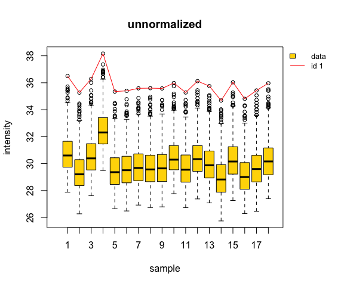
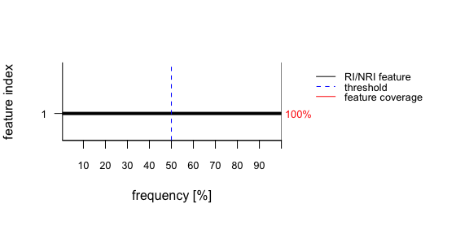
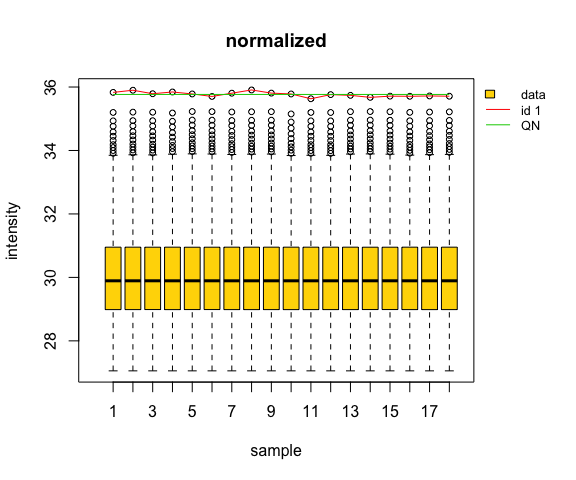

<!-- README.md is generated from README.Rmd. Please edit that file -->
MBQN Package
============

Mean/Median-balanced quantile normalization for preprocessing omics data

Description
-----------

This package contains a modified quantile normalization (QN) for preprocessing and analysis of omics or other matrix-like organized data with intensity values biased by global, columnwise distortions of intensity mean and scale. The modification balances the mean intensity of features (rows) which are rank invariant (RI) or nearly rank invariant (NRI) across samples (columns) before quantile normalization \[1\]. This helps to prevent an over-correction of the intensity profiles of RI and NRI features by classical QN and therefore supports the reduction of systematics in downstream analyses. Additional package functions help to detect, identify, and visualize potential RI or NRI features in the data and demonstrate the use of the modification.

Installation
------------

To install this package, you need R version &gt;= 3.3.3.

For installation from Bioconductor run in R:

``` r
#if (!requireNamespace("BiocManager", quietly = TRUE))
#    install.packages("BiocManager")
BiocManager::install("MBQN")
```

For installation from Github run in R:

``` r
# install.packages("devtools")
devtools::install_github("arianeschad/mbqn")
```

or

``` r
# install.packages("githubinstall")
githubinstall::githubinstall("mbqn")
```

Dependencies
------------

The core of the MBQN package uses `normalizeQuantiles()` from the package `limma`\[2\], available at <https://bioconductor.org/packages/release/bioc/html/limma.html>, for computation of the quantile normalization. Optionally, `normalize.quantiles()` from the package `preprocessCore`\[3\], available at <https://bioconductor.org/packages/release/bioc/html/preprocessCore.html>, can be used. <br/>

The example function `mbqnExample()` in MBQN uses data from the PRIDE repository. To run this function one needs the R package `rpx` \[4\] to download the data. <br/>

To install these packages in R run: <br/>

``` r
BiocManager::install(pkgs = c("preprocessCore","limma","rpx"))
```

Additional packages needed to run MBQN examples: <br/>

``` r
install.packages(pkgs = c("filesstrings"), dependencies = TRUE)
```

After installation, check `mbqnDemo` and `mbqnExample` for full working examples with further documentation.

Basic Usage
-----------

The package provides two basic functions: `mbqn()` applies quantile normalization or mean-balanced quantile normalization to a matrix. `mbqnNRI()` applies quantile normalization and mean balanced quantile normalization only to selected nearly rank invariant and rank invariant features, specified by a threshold or manually. The input matrix may contain NAs. To run one of these functions you will need to provide an input matrix similar to the data matrix in `mbqnDemo()` or `mbqnExample()`. The argument `FUN` is used to select between classical quantile normalization (default), and mean or median balanced quantile normalization. The function `mbqnCheckSaturation()` can be used to check a data matrix for rank or nearly rank invariant features. It provides a list of potential RI/NRI features, a rank invariance frequency, and a graphical output.

Examples
--------

Example 1: Generate a distorted omics-like matrix of log2-transformed intensities with missing values and a single rank invariant feature:

``` r
## basic example
library("MBQN")
# mtx <- matrix(c(5,2,3,NA,4,1,4,2,3,4,6,NA),ncol=3)
mtx <- mbqnSimuData("omics.dep")
mtx <- mbqnSimuDistortion(mtx)$x.mod
```

``` r
plot.new()
mbqnBoxplot(mtx, irow = 1, main = "unnormalized")
```


<p class="caption">
Fig. 1 Boxplot of the unnormalized, distorted intensity data matrix. The first feature is an RI feature (red line). It has maximum intensity for each sample!
</p>

<br /> Apply check for rank invariant (RI) or nearly rank invariant (NRI) features to the data matrix and visualize result:

``` r
ri.obj <- mbqnGetNRIfeatures(mtx, low_thr = 0.5)
#> [1] "Maximum frequency of RI/NRI feature(s):  100 %"
```

``` r
plot.new()
mbqnPlotRI(ri.obj)
```


<p class="caption">
Fig. 2 Correctly detected and identified RI feature with a data coverage of 100% across samples.
</p>

<br /> Apply quantile normalization with and without balancing the RI feature and compare the intensity features:

``` r
plot.new()
mtx.norm <- mbqnNRI(x = mtx, FUN = median, verbose = FALSE) # MBQN
mtx.qn <- mbqnNRI(x = mtx, FUN = NULL, verbose = FALSE) # QN
mbqnBoxplot(mtx.norm, irow = ri.obj$ip, vals = data.frame(QN = mtx.qn[ri.obj$ip,]), main = "normalized")
```


<p class="caption">
Fig. 3 Quantile normalized intensities with balanced and unbalanced normalized RI feature. Classical quantile normalization suppresses any intensity variation of the RI feature, while the MBQN preserves its variation while reducing systematic batch effects!
</p>

<br /><br /> <br /><br /> Example 2: This example downloads an LFQ intensity dataset from the PRIDE repository, normalizes the data, identifies RI/NRI features, and give graphical output. One can choose between four data sets. By default data files are stored in the current working directory currentdir/PXDxxx.

``` r
## Normalize LFQ intensity data from the PRIDE repository
mbqnExample(which.example = 1)
```

In order to run `mbqnExample()`, the respective proteinGroups.txt file must be first downloaded from PRIDE, e.g. with `MBQN:::get_pxdfile()` to a user-specified directory or you can directly download the data by running `mbqnExample()` to currentdir/PXDxxx.

Figures
-------

Figures created with MBQN are saved as pdf in the current working directory.

Documentation
-------------

To view the documentation for MBQN, type in R:

``` r
??MBQN
```

or:

``` r
browseVignettes("MBQN")
```

References
----------

\[1\] A. Schad and C. Kreutz, MBQN: an R/Bioconductor package for mean/ median-balanced quantile normalization. In prep. 2019 <br/> \[2\] Ritchie, M.E., Phipson, B., Wu, D., Hu, Y., Law, C.W., Shi, W., and Smyth, G.K. (2015). limma powers differential expression analyses for RNA-sequencing and microarray studies. Nucleic Acids Research 43(7), e47. <br/> \[3\] Ben Bolstad (2018). preprocessCore: A collection of pre-processing functions. R package version 1.44.0. <https://github.com/bmbolstad/preprocessCore> <br/> \[4\] Laurent Gatto (2019). rpx: R Interface to the ProteomeXchange Repository. R package version 1.18.1. <https://github.com/lgatto/rpx>
